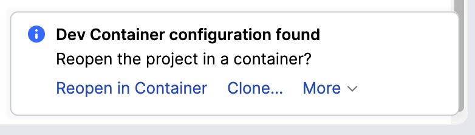
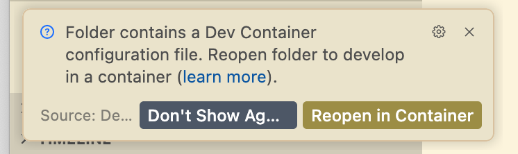

<p align="center">
  <a href="https://github.com/datarobot-community/datarobot-agent-application">
    
  </a>
</p>
<p align="center">
    <span style="font-size: 1.5em; font-weight: bold; display: block;">Agentic Starter application template</span>
</p>

<p align="center">
  <a href="https://datarobot.com">Homepage</a>
  ·
  <a href="https://docs.datarobot.com/en/docs/agentic-ai/agentic-develop/index.html">Documentation</a>
  ·
  <a href="https://docs.datarobot.com/en/docs/get-started/troubleshooting/general-help.html">Support</a>
</p>

<p align="center">
  <a href="https://app.datarobot.com/usecases/application-templates/69090966c601dbd8c8514516?referrerUrl=github">
    
  </a>
  <a href="https://app.eu.datarobot.com/usecases/application-templates/69090966c601dbd8c8514516?referrerUrl=github">
    
  </a>
  <a href="https://app.jp.datarobot.com/usecases/application-templates/69090966c601dbd8c8514516?referrerUrl=github">
    
  </a>
  <a href="https://app.jp.datarobot.com/usecases/application-templates/69090966c601dbd8c8514516?referrerUrl=github">
    
  </a>
  <a href="https://github.com/datarobot-community/datarobot-agent-application/tags">
    
  </a>
  <a href="/LICENSE">
    
  </a>
  <a href="https://join.slack.com/t/datarobot-community/shared_invite/zt-3uzfp8k50-SUdMqeux25ok9_5wr4okrg">
    
  </a>
</p>

This template gives you a ready-to-use application for building and deploying agentic workflows with multi-agent frameworks, a FastAPI backend server, a React frontend, and an MCP server.
The template streamlines setup for new agentic applications with minimal configuration.
It supports local development and testing on macOS, Linux, and Windows, as well as one-command deployments to production environments within DataRobot.

> [!CAUTION]
> This repository updates frequently.
> Make sure to update your local branch regularly to obtain the latest changes.

# Table of contents

- [Quick start](#quick-start)
  - [Install prerequisite tools](#install-prerequisite-tools)
    - [Windows prerequisites](#windows-prerequisites)
  - [Prepare your local development environment](#prepare-your-local-development-environment)
  - [Run your agent](#run-your-agent)
  - [Local tracing with `dr xp`](#local-tracing-with-dr-xp)
- [Develop your agent](#develop-your-agent)
  - [Component documentation](#component-documentation)
  - [DataRobot documentation](#datarobot-documentation)
- [Deploy your agent](#deploy-your-agent)
- [MCP server](#mcp-server)
- [OAuth applications](#oauth-applications)
- [Agent-to-agent](#agent-to-agent)
- [Troubleshooting](#troubleshooting)
- [Get help](#get-help)

For information on the latest changes to the template, see the [CHANGELOG](CHANGELOG.md).

> [!IMPORTANT]
> This template requires a minimum of 4GB of RAM to run.

# Quick start

Follow the instructions in the sections below to install the prerequisite tools and develop the Agentic Starter application template locally.

> [!NOTE]
> On Windows, complete the [Windows prerequisites](#windows-prerequisites) before you run `dr start`. The rest of the quickstart matches the macOS and Linux flow.

## Install prerequisite tools

Before you begin, install the following tools.
If you already have these tools installed, ensure that they are at the required version (or newer) indicated in the table below.
For example commands to install the tools, see the [Detailed installation commands](#detailed-installation-commands) section.

| Tool         | Version    | Description                     | Installation guide            |
|--------------|------------|---------------------------------|-------------------------------|
| dr (DataRobot CLI) | >= 0.2.79  | The DataRobot CLI for templates, auth, and task execution. | [DataRobot CLI installation](https://github.com/datarobot-oss/cli#installation) |
| xp (DataRobot XP plugin) | >= 1.3.2 | A `dr` plugin for local experimentation tracing. | `dr plugin install xp` |
| git      | >= 2.30.0  | A version control system.       | [git installation guide](https://git-scm.com/book/en/v2/Getting-Started-Installing-Git)      |
| uv       | >= 0.10.3  | A Python package manager.        | [uv installation guide](https://docs.astral.sh/uv/getting-started/installation/)       |
| Pulumi   | >= 3.206.0 | An Infrastructure as Code tool. | [Pulumi installation guide](https://www.pulumi.com/docs/iac/download-install/)                   |
| Taskfile | >= 3.43.3  | A task runner.                  | [Taskfile installation guide](https://taskfile.dev/docs/installation)                        |
| NodeJS   | >= 24      | JavaScript runtime for frontend development. | [NodeJS installation guide](https://nodejs.org/en/download/)                        |

> [!TIP]
> Make sure to install the tools system-wide rather than in a virtual environment so they are available in your terminal sessions.

**DataRobot CLI (dr)**&mdash;install the latest version with `curl https://cli.datarobot.com/install | sh` (macOS/Linux), `irm https://cli.datarobot.com/winstall | iex` (Windows PowerShell), or via Homebrew: `brew install datarobot-oss/taps/dr-cli`. To update, run `dr self update`. Verify with `dr --version` or `dr self version`.

### Windows prerequisites

Complete these steps on Windows **before** you clone the repository. Skipping them checks symlinks out as plain text files and leaves the working tree broken.

1. Enable symlink support in Git:

   ```powershell
   git config --global core.symlinks true
   ```

2. Grant permission to create symlinks using one of the following options:

   - **Developer Mode (recommended)**&mdash;on Windows 11, open **Settings → System → Advanced → Developer Mode** and turn Developer Mode on. See [Enable your device for development](https://learn.microsoft.com/en-us/windows/apps/get-started/enable-your-device-for-development) for details.
   - **Administrator terminal**&mdash;launch PowerShell or Windows Terminal with **Run as administrator** and run every repo operation from that elevated session. At minimum, use an elevated session for `git clone`, `dr start`, `dr run deploy`, and any `git checkout` or `git pull` that touches symlinked paths. This template uses Git symlinks at `.claude/skills`, `fastapi_server/core`, `infra/infra/llm.py`, and `infra/infra/oauth.py`.

3. After Git is installed, ensure that the following directory is present in your system PATH: `[path_of_git_installation]\usr\bin`. For example, if Git is installed in `C:\Program Files\Git`, add `C:\Program Files\Git\usr\bin` to your PATH using the following commands:

   ```powershell
   $dir = 'C:\Program Files\Git\usr\bin'  # Change if Git is installed elsewhere.
   $p = [Environment]::GetEnvironmentVariable('PATH', 'User')
   [Environment]::SetEnvironmentVariable('PATH', "$p;$dir", 'User')
   ```

   This location provides Linux helper commands that are needed for the Agentic Starter to work correctly. Once the command is executed, close and reopen the terminal (or IDE) so new processes pick up the change.

### Detailed installation commands

The following sections provide example installation commands for macOS, Linux (Debian/Ubuntu/DataRobot codespace), and Windows (PowerShell).
Click the dropdown below that corresponds to your operating system:

- <details><summary><b>macOS</b></summary>
  <br>

  macOS users can install the prerequisite tools using Homebrew. First, install Homebrew if you do not already have it.

  ```sh
  /bin/bash -c "$(curl -fsSL https://raw.githubusercontent.com/Homebrew/install/HEAD/install.sh)" # Install Homebrew if it is not already installed.
  ```

  Then, install the prerequisite tools with it:

  ```sh
  brew install datarobot-oss/taps/dr-cli uv pulumi/tap/pulumi go-task node git
  ```

</details>

- <details><summary><b>Linux</b></summary>
  <br>

  Linux users can install the prerequisite tools using the package manager for their distribution.

  ```sh
  curl https://cli.datarobot.com/install | sh
  sudo apt-get update
  sudo apt-get install -y python3 python3-pip python3-venv
  sudo apt-get install -y git
  curl -LsSf https://astral.sh/uv/install.sh | sh
  curl -fsSL https://get.pulumi.com | sh
  sh -c "$(curl --location https://taskfile.dev/install.sh)" -- -d
  sudo apt-get install -y nodejs npm
  ```

</details>

- <details><summary><b>Windows (PowerShell)</b></summary>
  <br>

  Complete [Windows prerequisites](#windows-prerequisites) before you run `dr start`.

  Windows users can install the prerequisite tools with PowerShell:

  ```powershell
  irm https://cli.datarobot.com/winstall | iex
  powershell -ExecutionPolicy ByPass -c "irm https://astral.sh/uv/install.ps1 | iex"
  winget install Git.Git
  winget install Pulumi.Pulumi
  winget install Task.Task
  winget install OpenJS.NodeJS
  ```

  You also need C++ build tools to compile some Python packages. Install [Visual Studio Build Tools](https://visualstudio.microsoft.com/visual-cpp-build-tools/) with the **Desktop development with C++** workload, or run:

  ```powershell
  winget install Microsoft.VisualStudio.2022.BuildTools --force --override "--wait --passive --add Microsoft.VisualStudio.Component.VC.Tools.x86.x64 --add Microsoft.VisualStudio.Component.Windows11SDK.22621"
  ```

</details>

> [!NOTE]
> After installing `uv`, run `uv tool update-shell` once so your shell picks up the updated `PATH` before using `uv tool run` or invoking tools installed via `uv tool install`.

> [!IMPORTANT]
> You also need a compatible C++ compiler and build tools installed on your system to compile some Python packages.

<details><summary><i>Click here for details on using a development container</i></summary>

### Use a development container (experimental)

[Dev containers](https://containers.dev/) allow you to use a container environment for local development. They are integrated with [modern IDEs](https://containers.dev/supporting) such as VSCode and PyCharm, and the [Dev Container CLI](https://containers.dev/supporting#devcontainer-cli) allows you to integrate them with terminal-centric development workflows.

**NOTE:**
Dev containers are an alternative to native Windows development. [Docker Desktop](https://docs.docker.com/desktop/) is the recommended backend for running dev containers, but any Docker-compatible backend is supported. You can also use a [DataRobot codespace](https://docs.datarobot.com/en/docs/workbench/wb-notebook/codespaces/index.html), [Windows Subsystem for Linux (WSL)](https://learn.microsoft.com/en-us/windows/wsl/install), or a virtual machine if you prefer a Linux environment.

This template offers a `devcontainer` with all prerequisites installed. To start working in it:

1. Open the template in PyCharm (version >= 2023.2, Pro) or VSCode, and the IDE prompts you to reopen it in a container.

    *PyCharm*:

    

    *VSCode*:

    

2. Click Reopen in Container to proceed.
3. If you work directly in the terminal, run:

```sh
devcontainer up --workspace-folder . \&\& devcontainer exec --workspace-folder . /bin/sh
```

</details>

> [!NOTE]
> If you do not have a Pulumi account, use `pulumi login --local` for local login or create a free account at [the Pulumi website](https://app.pulumi.com/signup).

## Prepare your local development environment

> [!NOTE]
> If you are using a DataRobot codespace, you must expose several ports for local testing. See the [DataRobot codespace port configuration](#datarobot-codespace-port-configuration) section for more details.

Run the following command to start the local development environment:

```sh
dr start
```

If you run `dr start` from a directory that is not yet a template clone, you first go through template selection and clone; once in the template directory, the wizard guides you through configuring your application and creates a `.env` file.
You see progress lines in the terminal (e.g., ✓ Starting application quickstart process…, ✓ Checking DataRobot CLI version…, and so on) as each step runs.
For more details on the individual wizard steps, click the dropdown below.

<details><summary><b>Click here for a detailed walkthrough of the wizard steps</b></summary>
<br>

1. Initially, the wizard opens a web browser window to automatically configure your API endpoint and key.
   - If the browser does not open automatically, look for a URL in the terminal output and open it manually.
   - Click Proceed in the browser to continue.
   - If you encounter authentication issues, ensure you're logged into DataRobot in your browser.
2. Select the Agentic Starter and press `Enter`.
3. Enter the directory name for your application and press `Enter`. The default is `datarobot-agent-application`.
4. Provide a secret key to sign cookies for your session and press `Enter`. If you do not provide a value, the wizard uses a randomly generated one.
5. Choose your OAuth provider and press `Enter`.
   - Choose DataRobot OAuth Provider (default) to use DataRobot’s OAuth, or Authlib OAuth Provider to host OAuth in the app.
   - For additional information on authorization server configuration, see the [OAuth applications documentation](https://docs.datarobot.com/en/docs/agentic-ai/agentic-develop/agentic-authentication.html#oauth-2-0-authentication).
6. Enter a passphrase (or leave blank if you do not want to use a passphrase) for your Pulumi stack and press `Enter`.
7. Specify the ID of a DataRobot Use Case (e.g., `69331fad5e07469e7c4f5c6f`), if one is available, and press `Enter`.
   - You can find your Use Case ID by navigating to the Use Case in the DataRobot UI and copying the ID from the URL.
   - If left blank, the wizard creates a new Use Case automatically.
8. Specify your LLM integration and press `Enter`.
   - For additional information on LLM configuration, see the [LLM configuration documentation](https://docs.datarobot.com/en/docs/agentic-ai/agentic-develop/agentic-llm-providers-metadata.html).
   - If you choose DataRobot Deployed LLM, you enter the deployment ID for your custom model LLM (`LLM_DEPLOYMENT_ID`). The template sets `USE_DATAROBOT_LLM_GATEWAY=0` automatically so traffic goes to that deployment rather than the LLM Gateway.
9. Review the `.env` configuration summary displayed and press `Enter` to confirm.

   > [!NOTE]
   > This step takes several minutes to complete.

10. After configuration finishes, choose whether to use the YAML-based NeMo Agent Toolkit template:
   - Press `y` to use the YAML-based NeMo Agent Toolkit template.
   - Press `n` to choose from a list of available agent templates (default).
11. Choose an agent memory provider when prompted (None, Mem0, or DataRobot Memory Service). The selection is stored in `.datarobot/answers/agent-agent.yml` as `use_agent_memory`. See [Agent memory](docs/agent/agent-memory.md) for provider details and follow-up steps (for example, `MEM0_API_KEY` or running `task deploy-dev` to provision the DataRobot Memory Service).
12. Finally, choose a Pulumi stack to use for your application and press `Enter`. To create a new stack, press `Enter` and enter a name when prompted. The name cannot match any existing stack name.

</details>

> [!NOTE]
> The first time you run `dr start` in this template, it runs `task start`, which composes the root `Taskfile.yml`, configures `.env`, installs dependencies, and deploys backing infrastructure (`deploy-dev`). Completion is tracked so later runs can skip redundant steps. To change environment variables later, use `dr dotenv setup` or `dr dotenv edit`. To update the agent component (for example, after pulling template changes), run `dr component update`.

After `dr start` completes successfully, you have:

- A `.env` file in your project root.
- An application directory (named `datarobot-agent-application` by default).

If you encounter any errors during setup, see the [Troubleshooting](#troubleshooting) section for help.
Now that your application is configured, proceed to the next section.

## Run your agent

If `dr start` created a new application directory, navigate to it before starting services:

```sh
cd datarobot-agent-application # Use the custom directory name you specified during the wizard, if different.
```

If you cloned this repository directly and ran `dr start` from the project root, you are already in the application directory and can skip the `cd` step.

Run the following command to start all components of the application:

```sh
dr run dev
```

This starts five processes in parallel:

- Application frontend (Vite)
- Application backend (FastAPI)
- Agent
- MCP server
- Local tracing dashboard (`dr xp` on port 8090)

Once all services are running:

1. Open your web browser and navigate to [http://localhost:5173](http://localhost:5173) to see the Agentic Starter interface.
2. Send a test message to verify that everything is working as expected.

From here, start customizing the agent by adding your own logic and functionality. See the section on [developing your agent](#develop-your-agent) for more details.

> [!NOTE]
> You can also start individual services in separate terminal windows; for example, `dr run agent:dev` (or `task agent:dev`) starts just the agent.

## Local tracing with `dr xp`

The [DataRobot Experimentation plugin](https://docs.datarobot.com/en/docs/agentic-ai/cli/experimentation-plugin.html) (`dr xp`) provides a local tracing dashboard for visualizing [OpenTelemetry traces](docs/base.md#local-tracing-otel) during development, making it easier to debug issues, understand execution flow, and verify agent behavior without deploying your application.

### Install the plugin (one-time)

The `xp` plugin is automatically installed during `dr start` as part of infrastructure setup. If you're working in an existing project or the plugin isn't already installed, install it manually:

```sh
dr plugin install xp
```

### Start the tracing UI

When you run `dr run dev`, it automatically starts the local development services and launches the local tracing dashboard at http://127.0.0.1:8090/, preconfigured to display traces for your Use Case.
If you want to start the Experimentation plugin separately, run:

```sh
dr xp [--type TYPE] [--entity-id ID]
```

# Develop your agent

Now that your agent has been built and tested, you are ready to customize it by adding your own logic and functionality.
The agent implementation lives in `./agent/agent/`: the main agent class is in `agent/agent/myagent.py` (`MyAgent`).
For structure and required components, see [AGENTS.md](AGENTS.md#agent-structure).
The template includes chat history support: conversation context is injected into the agent so multi-turn chats stay consistent. See [docs/agent/chat-history.md](docs/agent/chat-history.md) for how prior messages are passed, per-framework behavior, and CLI testing.
The frontend uses the DataRobot UI component registry (`@dr-ui`) for theming and reusable components; you can customize the UI via the shared theme and component set.

## Component documentation

The `docs/` directory contains detailed documentation for each component of this template:

| Document | Description |
|---|---|
| [Agent](docs/agent/README.md) | Agent architecture, file structure, framework-specific guides, tool integration, front servers, debugging, and [multi-turn chat history](docs/agent/chat-history.md). |
| [FastAPI backend](docs/fastapi_server/README.md) | Chat API, persistence (SQLite or Memory Space), OAuth, and AG-UI integration. |
| [LLM component](docs/llm.md) | Configuring LLM providers, DataRobot gateway, deployments, and external APIs. |
| [MCP server](docs/mcp-server.md) | MCP server architecture, optional co-deployment, custom tools, and deployment. |
| [OAuth applications](docs/oauth-applications.md) | OAuth provider setup for external service authentication. |

The agent documentation includes per-framework guides with tool integration and prompt modification examples:

| Framework | Guide |
|---|---|
| LangGraph (default) | [docs/agent/frameworks/langgraph.md](docs/agent/frameworks/langgraph.md) |
| CrewAI | [docs/agent/frameworks/crewai.md](docs/agent/frameworks/crewai.md) |
| LlamaIndex | [docs/agent/frameworks/llamaindex.md](docs/agent/frameworks/llamaindex.md) |
| NAT (NeMo Agent Toolkit) | [docs/agent/frameworks/nat.md](docs/agent/frameworks/nat.md) |
| Base (generic) | [docs/agent/frameworks/base.md](docs/agent/frameworks/base.md) |

See also:

- [AG-UI integration](docs/agent/ag-ui.md)&mdash;event-based agent UI protocol.
- [Agent-to-Agent (A2A)](docs/agent/agent2agent.md)&mdash;connect agents to other agents.
- [Debugging](docs/agent/debugging.md)&mdash;local debugging tips.

## DataRobot documentation

For additional guidance beyond what this template covers, see the official DataRobot documentation:

- [Customize your agent](https://docs.datarobot.com/en/docs/agentic-ai/agentic-develop/agentic-development.html)&mdash;modify agent logic, prompts, and behavior.
- [Add tools to your agent](https://docs.datarobot.com/en/docs/agentic-ai/agentic-develop/agentic-tools-integrate.html)&mdash;integrate MCP, custom, and global tools.
- [Configure LLM providers](https://docs.datarobot.com/en/docs/agentic-ai/agentic-develop/agentic-llm-providers.html)&mdash;set up DataRobot gateway, deployments, or external APIs.
- [Add Python packages](https://docs.datarobot.com/en/docs/agentic-ai/agentic-develop/agentic-python-packages.html)&mdash;manage dependencies via `uv` and custom Docker images.
- [Manage prompts](https://docs.datarobot.com/en/docs/agentic-ai/agentic-develop/agentic-development.html#modify-agent-prompts)&mdash;modify agent prompts per framework.
- [Agent authentication](https://docs.datarobot.com/en/docs/agentic-ai/agentic-develop/agentic-authentication.html)&mdash;API tokens, OAuth 2.0, and credential management.
- [Deploy agentic tools](https://docs.datarobot.com/en/docs/agentic-ai/agentic-develop/agentic-tools.html)&mdash;deploy global tools from the DataRobot Registry.
- [DataRobot agentic skills](https://docs.datarobot.com/en/docs/agentic-ai/agentic-develop/agentic-skills.html)&mdash;install modular skill packages for coding agents.
- [Implement tracing](https://docs.datarobot.com/en/docs/agentic-ai/agentic-develop/agentic-tracing-code.html)&mdash;add custom OpenTelemetry tracing for deployed agents.
- [Troubleshooting](https://docs.datarobot.com/en/docs/agentic-ai/agentic-develop/agentic-troubleshooting.html)&mdash;diagnose common setup, deployment, and runtime issues.

# Deploy your agent

Next, deploy your agent to DataRobot, which requires a Pulumi login.
Run the following command to deploy:

```sh
dr run deploy
```

You can also run `task deploy` from the project root after `dr start` composes `Taskfile.yml`.

> [!NOTE]
> The deployment process takes several minutes to complete.

Once deployment is complete, the script displays the deployment details, as shown in the example below. The deployment details vary based on your configuration.

```sh
Outputs:
    AGENT_DEPLOYMENT_ID                               : "69331fad5e07469e7c4f5c6f"
    Agent Custom Model Chat Endpoint [apptest] [agent]: "https://datarobot.com/api/v2/genai/agents/fromCustomModel/69331f816e1bf9f1890d5d1d/chat/"
    Agent Deployment Chat Endpoint [apptest] [agent]  : "https://datarobot.com/api/v2/deployments/69331fad5e07469e7c4f5c6f/chat/completions"
    Agent Execution Environment ID [apptest] [agent]  : "680fe4949604e9eba46b1775"
    Agent Playground URL [apptest] [agent]            : "https://datarobot.com/usecases/69331e4c3be0efe3b95a7be0/agentic-playgrounds/69331e4d1c036307186c9b16/comparison/chats"
    Agentic Starter [apptest]             : "https://datarobot.com/custom_applications/6933204a9e21e9b59b5a7bee/"
    DATABASE_URI                                      : "sqlite+aiosqlite:////tmp/agent_app/.data/agent_app.db"
    DATAROBOT_APPLICATION_ID                          : "6933204a9e21e9b59b5a7bee"
    DATAROBOT_OAUTH_PROVIDERS                         : (json) []

    LLM_DEFAULT_MODEL                                 : "azure/gpt-4o-2024-11-20"
    SESSION_SECRET_KEY                                : "secretkey123"
    USE_DATAROBOT_LLM_GATEWAY                         : "1"
    [apptest] [mcp_server] Custom Model Id            : "69331eebb49131d3d5430ac7"
    [apptest] [mcp_server] Deployment Id              : "69331f1f30548f83b668d9dc"
    [apptest] [mcp_server] MCP Server Base Endpoint   : "https://datarobot.com/api/v2/deployments/69331f1f30548f83b668d9dc/directAccess/"
    [apptest] [mcp_server] MCP Server MCP Endpoint    : "https://datarobot.com/api/v2/deployments/69331f1f30548f83b668d9dc/directAccess/mcp"
```

# MCP server

The Model Context Protocol (MCP) is an open standard that allows AI agents, such as large language models (LLMs), to discover and interact with external data sources, applications, and services in a secure and structured way.
For detailed information about the MCP server, see [MCP server documentation](docs/mcp-server.md).

# OAuth applications

For detailed information about configuring OAuth applications, see [OAuth applications documentation](docs/oauth-applications.md).

# Agent-to-agent

The template supports [Agent-to-Agent (A2A)](docs/agent/agent2agent.md) communication so agents can expose A2A endpoints and call remote agents. For authentication setup, see [A2A authentication](docs/agent/agent2agent-auth.md).

# Troubleshooting

This section covers common issues you may encounter and how to resolve them.

## Ports reference

The following ports are used by the application components during local development:

| Port  | Component                    | Description                                    | Configurable |
|-------|------------------------------|------------------------------------------------|--------------|
| 8080  | Web application              | Main web interface (proxied frontend)          | No           |
| 5173  | Vite dev server              | Frontend development server                    | No           |
| 8090  | Tracing dashboard            | Local `dr xp` experimentation UI               | No           |
| 8842  | Agent endpoint               | Local agent service endpoint                   | Yes (in wizard) |
| 9000  | MCP server                   | Model Context Protocol server                  | Yes (via `MCP_SERVER_PORT`) |

> [!NOTE]
> Ports 8080, 5173, and 8090 are fixed. The agent endpoint (8842) can be configured during the `dr start` wizard, and the MCP server port (9000) can be changed by setting the `MCP_SERVER_PORT` environment variable in your `.env` file.

### DataRobot codespace port configuration

If you are developing within a DataRobot codespace, the development ports need to be exposed.
This is configured in the Exposed Ports section of your Session Environment tab (pictured below).
The ports in the table above must be exposed for local testing.
If you cloned this application template using the `dr start` command and selected it from the gallery, the wizard configures these ports automatically; otherwise (for example, if you cloned manually) you must configure these ports manually.

There is a link next to the port to a URL where the service can be accessed when running locally in the codespace.


## DataRobot CLI issues

### Issue: "dr: command not found"

**Symptoms**: The shell cannot find the `dr` command.

**Solutions**:

1. Ensure the DataRobot CLI is installed (see [Install prerequisite tools](#install-prerequisite-tools)).
2. Check that the CLI binary is in your PATH:

   ```sh
   which dr
   # If not found, add the install directory to PATH (for example, /usr/local/bin).
   export PATH="/usr/local/bin:$PATH"
   ```

### Issue: CLI version too old or template requires a newer dr

**Symptoms**: The template or `dr start` reports that your CLI version is below the minimum (see `.datarobot/cli/versions.yaml`).

**Solution**: Update the DataRobot CLI:

```sh
dr self update
dr self version   # Verify the update.
```

## Port conflicts

### Issue: "Address already in use" or port conflict errors

**Symptoms**: Services fail to start with port conflict errors.

**Solutions**:

1. Identify the process using the port:

   ```sh
   # Check port 8080 (web application).
   lsof -i :8080

   # Check port 9000 (MCP server).
   lsof -i :9000

   # Check port 5173 (Vite dev server).
   lsof -i :5173

   # Check port 8090 (tracing dashboard).
   lsof -i :8090
   ```

2. Kill the process (replace `PORT` with the actual port number):

   ```sh
   lsof -i :PORT | grep LISTEN | awk '{print $2}' | xargs kill -9
   ```

3. Or change the port:
   - **MCP server**&mdash;set `MCP_SERVER_PORT` in your `.env` file.
   - **Agent endpoint**&mdash;configure during the `dr start` wizard (default is 8842).

## Service startup issues

### Issue: Services won't start or fail immediately

**Solutions**:

1. Verify prerequisites are installed:

   ```sh
   dr --version
   git --version
   uv --version
   pulumi version
   task --version
   node --version
   ```

2. Check dependencies are installed:

   ```sh
   dr run install
   ```

3. Verify environment variables:
   - Ensure the `.env` file exists in the project root.
   - Check that required variables are set (see [Prepare your local development environment](#prepare-your-local-development-environment)).

4. Check logs:
   - Review terminal output for specific error messages.
   - Check for missing API tokens or invalid endpoints.

## Quickstart and wizard issues

### Issue: Symlinks appear as plain text files on Windows

**Symptoms**: Files such as `infra/infra/llm.py` or `fastapi_server/core` contain a path string instead of linking to another file, or commands fail with missing-module errors after clone.

**Solutions**:

1. Complete [Windows prerequisites](#windows-prerequisites) before you clone.
2. If you already cloned without symlink support, delete the local repository and clone again after you configure Git and Developer Mode (or use an administrator terminal).
3. Verify Git symlink settings:

   ```powershell
   git config --global --get core.symlinks
   ```

   The command should print `true`.

### Issue: "No start command or quickstart script found"

**Symptoms**: You run `dr start` inside a DataRobot template directory and see a message that no start command or quickstart script was found.

**Explanation**: The CLI looks for either a `task start` task in the Taskfile or an executable script in `.datarobot/cli/bin/` whose name starts with `quickstart`. This template defines `task start` in `.Taskfile.template`, which is composed into the root `Taskfile.yml` when you run `dr start` or `dr task compose`. If you see this message, run `dr task compose` or `dr start` to generate the Taskfile.

### Issue: `dr start` wizard fails or is interrupted

**Solutions**:

1. Restart the wizard:

   ```sh
   dr start
   ```

2. Check for existing configuration:
   - If `.env` file exists, you may need to remove it and start fresh:

     ```sh
     # Back up the existing file first, if needed.
     cp .env .env.backup
     rm .env
     dr start
     ```

3. Verify DataRobot credentials:
   - Ensure you have a valid DataRobot API token.
   - Check that your DataRobot endpoint URL is correct.
   - Verify your account has the necessary permissions.

4. Check network connectivity:
   - Ensure you can access your DataRobot instance.
   - Verify firewall settings allow connections.

## MCP server connection issues

### Issue: Agent can't connect to MCP server

**Symptoms**: Agent errors mention MCP connection failures or tools not available.

**Solutions**:

1. Verify MCP server is running:

   ```sh
   # Check whether the MCP server process is running.
   curl http://localhost:9000/
   ```

2. Check MCP server logs:
   - Review the terminal where `dr run mcp_server:dev` is running.
   - Look for connection or authentication errors.

3. Verify port configuration:
   - Check that `MCP_SERVER_PORT` in `.env` matches the port the server is using.
   - See [Ports reference](#ports-reference) for default ports.

4. Check environment variables:
   - Ensure `DATAROBOT_API_TOKEN` is set correctly.
   - Verify `DATAROBOT_ENDPOINT` is correct.

## OAuth configuration issues

### Issue: OAuth authentication fails or redirects don't work

**Solutions**:

1. Verify redirect URLs:
   - Ensure all callback URLs are added to your OAuth application.
   - Check that URLs match exactly (including trailing slashes).
   - See [OAuth applications documentation](docs/oauth-applications.md) for required URLs.

2. Check OAuth credentials:
   - Verify `GOOGLE_CLIENT_ID` and `GOOGLE_CLIENT_SECRET` (or Box equivalents) are set in `.env`.
   - Ensure credentials are correct and not expired.

3. Verify OAuth scopes:
   - Check that all required scopes are enabled in your OAuth application.
   - See provider-specific sections for required scopes.

4. Check OAuth providers in DataRobot:
   - Navigate to `YOUR_DATAROBOT_URL/account/oauth-providers`.
   - Verify providers are created and configured correctly.

## Deployment issues

### Issue: `dr run deploy` fails

**Solutions**:

1. Verify Pulumi is configured:

   ```sh
   pulumi whoami
   ```

   - If not logged in, use `pulumi login --local` or create an account at [app.pulumi.com](https://app.pulumi.com/signup)

2. Check prerequisites:
   - Test all services locally before deploying.
   - Verify the `.env` file has all required variables.

3. Review Pulumi stack:

   ```sh
   pulumi stack ls
   ```

   - Ensure you use the correct stack.
   - Check for stack configuration issues.

4. Check deployment logs:
   - Review Pulumi output for specific error messages.
   - Verify the DataRobot API token has deployment permissions.

## Frontend build issues

### Issue: Frontend build fails or displays errors

**Solutions**:

1. Clear build cache:

   ```sh
   cd frontend_web
   rm -rf node_modules dist
   npm install
   ```

2. Check Node.js version:

   ```sh
   node --version
   ```

   - Ensure Node.js >= 24 is installed (see [Install prerequisite tools](#install-prerequisite-tools)).

3. Verify dependencies:

   ```sh
   cd frontend_web
   npm install
   ```

## General debugging tips

1. Check service status:
   - Verify all required services are running in separate terminals.
   - Check that services are listening on expected ports (see [Ports reference](#ports-reference)).

2. Review logs:
   - Check terminal output for each running service.
   - Look for error messages or stack traces.

3. Verify configuration:
   - Review the `.env` file for missing or incorrect values.
   - Check that file paths and URLs are correct.

4. Test components individually:
   - Run services one at a time to isolate issues.

5. Update dependencies:

   ```sh
   dr run install
   ```


# Get help

If you encounter issues or have questions, try the following:

- [DataRobot documentation](https://docs.datarobot.com/en/docs/agentic-ai/agentic-develop/index.html)&mdash;detailed guides for agentic development.
- [DataRobot CLI documentation](https://github.com/datarobot-oss/cli)&mdash;run `dr --help` for commands and options; see the [`dr start` command](https://github.com/datarobot-oss/cli/blob/main/docs/commands/start.md) for the full quickstart flow, options (`--yes`), and behavior outside a repository.
- [Contact DataRobot](https://docs.datarobot.com/en/docs/get-started/troubleshooting/general-help.html)&mdash;support and escalation paths.
- [GitHub repository issues](https://github.com/datarobot-community/datarobot-agent-application)&mdash;report bugs or request features.
